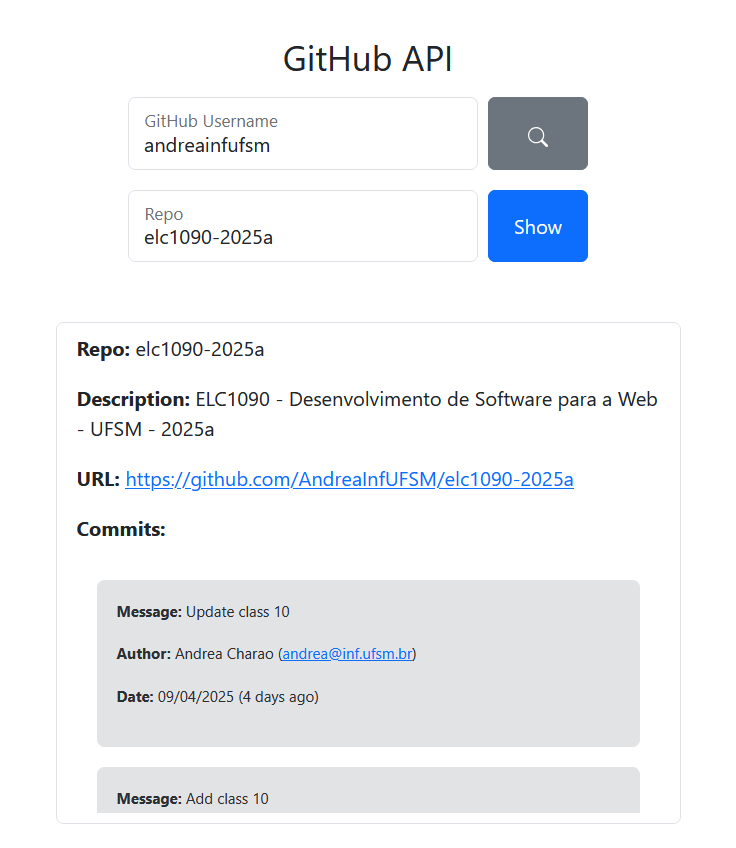

.

#### Deploy

https://elc1090.github.io/project2a-2025a-apfmota/github-api-tutorial-main/index.html

#### Desenvolvedor(a)

Andriel Prieto Fernandes Mota

#### Ambiente de desenvolvimento

Preencha aqui uma lista detalhada de ferramentas de desenvolvimento usadas, por exemplo:
- VS Code

#### Créditos

- Documentação da API do GitHub
- Documentação do bootstrap

#### Bastidores

Foi divertido. A API do github é bastante intuitiva e fácil de utilizar. Nunca tinha usado bootstrap mas também é bastante intuitivo e a documentação tem exemplos muito bons.

---
Projeto entregue para a disciplina de [Desenvolvimento de Software para a Web](http://github.com/andreainfufsm/elc1090-2025a) em 2025a
